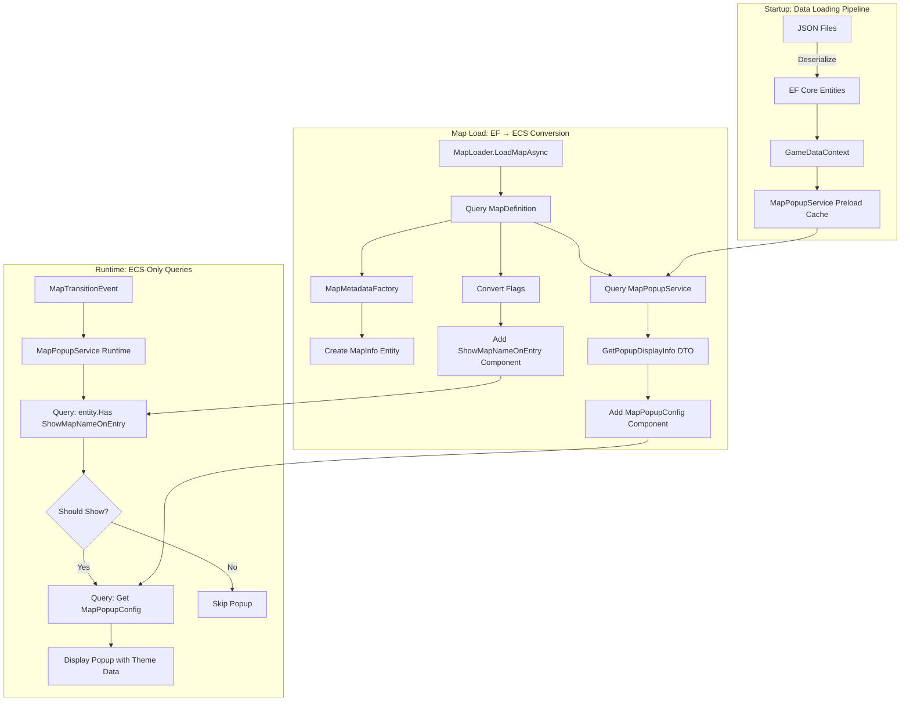

# Data Architecture Separation Plan: EF Core vs ECS

## Executive Summary

**Recommendation: Hybrid Approach (Option B+)** - Keep popup themes and static map metadata in EF Core with proper DTOs, convert to ECS components at map load time, and use ECS as the single source of runtime truth.

**Key Principle**: EF Core owns **static definitions**, ECS owns **runtime state**.

---

## 1. Architecture Decision

### Current Problems Identified

1. **Dual storage of ShowMapName**: Lives in both `MapDefinition.ShowMapName` (EF Core) and `ShowMapNameOnEntry` component (ECS)
2. **Mixed query patterns**: `MapPopupService` queries both EF Core (`MapPopupDataService`) and ECS (`entity.Has<ShowMapNameOnEntry>()`)
3. **Unclear ownership**: Who owns the truth for popup display decisions?
4. **Tight coupling**: Runtime service depends on both data layers simultaneously

### Recommended Approach: **Hybrid with Clear Boundaries**

```
┌─────────────────────────────────────────────────────────────┐
│ EF Core Layer (Static Data - GameData/)                    │
├─────────────────────────────────────────────────────────────┤
│ - PopupTheme entities (wood, marble, stone)                │
│ - MapSection entities (MAPSEC_LITTLEROOT_TOWN)             │
│ - MapDefinition entities (map metadata + flags)            │
│ - Immutable after game start (modding can override)        │
│ - Queried ONLY during map loading pipeline                 │
└─────────────────────────────────────────────────────────────┘
                            ↓
                    ┌───────────────┐
                    │  Loading DTOs │ (Immutable bridge)
                    └───────────────┘
                            ↓
┌─────────────────────────────────────────────────────────────┐
│ ECS Layer (Runtime State - Ecs/)                           │
├─────────────────────────────────────────────────────────────┤
│ - MapInfo component (runtime map ID, dimensions)           │
│ - ShowMapNameOnEntry flag component (converted from EF)    │
│ - MapPopupConfig component (theme data as DTO)             │
│ - RegionSection component (MAPSEC reference)               │
│ - Runtime queries for gameplay (NO EF Core access)         │
└─────────────────────────────────────────────────────────────┘
```

### Why Hybrid?

**Keep in EF Core:**
- PopupTheme/MapSection data is **static content** (like sprites, tilesets)
- These are **mod-friendly** (can override via JSON files)
- Themes can be reused across hundreds of maps (memory efficient)
- Fits EF Core's strength: relational queries for content loading

**Move to ECS at Load Time:**
- ECS owns **runtime decisions** (should I show popup? which theme?)
- ECS components enable **fast spatial queries** (no DB hits during gameplay)
- Component-based architecture fits **data-oriented design**
- No circular dependencies between layers

---

## 2. Data Flow Diagram



---

## 3. DTO Design

### 3.1. PopupDisplayDTO (Immutable Runtime Data)

```csharp
namespace MonoBallFramework.Game.GameData.DTOs;

/// <summary>
/// Immutable DTO containing all data needed to render a map popup.
/// Created from EF Core entities during map loading, stored in ECS components.
/// </summary>
public readonly record struct PopupDisplayDTO
{
    /// <summary>
    /// MAPSEC display name (e.g., "LITTLEROOT TOWN").
    /// </summary>
    public required string SectionName { get; init; }

    /// <summary>
    /// Background asset ID (e.g., "wood_background").
    /// </summary>
    public required string BackgroundAssetId { get; init; }

    /// <summary>
    /// Outline asset ID (e.g., "wood_outline").
    /// </summary>
    public required string OutlineAssetId { get; init; }

    /// <summary>
    /// Theme ID for debugging (e.g., "wood").
    /// </summary>
    public required string ThemeId { get; init; }

    /// <summary>
    /// MAPSEC ID for reference (e.g., "MAPSEC_LITTLEROOT_TOWN").
    /// </summary>
    public required string SectionId { get; init; }

    /// <summary>
    /// Creates a DTO from MapSection and PopupTheme entities.
    /// </summary>
    public static PopupDisplayDTO FromEntities(MapSection section, PopupTheme theme)
    {
        return new PopupDisplayDTO
        {
            SectionName = section.Name,
            BackgroundAssetId = theme.Background,
            OutlineAssetId = theme.Outline,
            ThemeId = theme.Id,
            SectionId = section.Id
        };
    }

    /// <summary>
    /// Creates a default fallback DTO (used when no section data exists).
    /// </summary>
    public static PopupDisplayDTO CreateDefault(string mapDisplayName)
    {
        return new PopupDisplayDTO
        {
            SectionName = mapDisplayName.ToUpperInvariant(),
            BackgroundAssetId = "wood_background",
            OutlineAssetId = "wood_outline",
            ThemeId = "wood",
            SectionId = "MAPSEC_UNKNOWN"
        };
    }
}
```

### 3.2. MapLoadingDTO (Complete Map Metadata)

```csharp
namespace MonoBallFramework.Game.GameData.DTOs;

/// <summary>
/// Complete DTO containing all data needed to create ECS components for a map.
/// Acts as a bridge between EF Core entities and ECS components.
/// </summary>
public readonly record struct MapLoadingDTO
{
    // Core map identity
    public required string MapId { get; init; }
    public required string DisplayName { get; init; }
    public required string Region { get; init; }

    // Map properties (will become ECS components)
    public required string? MusicId { get; init; }
    public required string Weather { get; init; }
    public required string BattleScene { get; init; }
    public required string? MapType { get; init; }

    // Popup configuration (converted from MapSection + PopupTheme)
    public required PopupDisplayDTO? PopupConfig { get; init; }

    // Flags (will become empty marker components)
    public required bool ShowMapName { get; init; }
    public required bool CanFly { get; init; }
    public required bool RequiresFlash { get; init; }
    public required bool AllowRunning { get; init; }
    public required bool AllowCycling { get; init; }
    public required bool AllowEscaping { get; init; }

    // Map connections
    public required ConnectionDTO? NorthConnection { get; init; }
    public required ConnectionDTO? SouthConnection { get; init; }
    public required ConnectionDTO? EastConnection { get; init; }
    public required ConnectionDTO? WestConnection { get; init; }

    /// <summary>
    /// Creates a DTO from MapDefinition entity and optional popup data.
    /// </summary>
    public static async Task<MapLoadingDTO> FromDefinitionAsync(
        MapDefinition mapDef,
        GameData.Services.MapPopupService popupService,
        CancellationToken ct = default)
    {
        // Query popup data if region section is defined
        PopupDisplayDTO? popupConfig = null;
        if (!string.IsNullOrEmpty(mapDef.RegionMapSection))
        {
            var popupInfo = await popupService.GetPopupDisplayInfoAsync(
                mapDef.RegionMapSection, ct);

            if (popupInfo != null)
            {
                popupConfig = new PopupDisplayDTO
                {
                    SectionName = popupInfo.SectionName,
                    BackgroundAssetId = popupInfo.BackgroundAssetId,
                    OutlineAssetId = popupInfo.OutlineAssetId,
                    ThemeId = popupInfo.ThemeId,
                    SectionId = popupInfo.SectionId
                };
            }
        }

        return new MapLoadingDTO
        {
            MapId = mapDef.MapId.Value,
            DisplayName = mapDef.DisplayName,
            Region = mapDef.Region,
            MusicId = mapDef.MusicId,
            Weather = mapDef.Weather,
            BattleScene = mapDef.BattleScene,
            MapType = mapDef.MapType,
            PopupConfig = popupConfig,
            ShowMapName = mapDef.ShowMapName,
            CanFly = mapDef.CanFly,
            RequiresFlash = mapDef.RequiresFlash,
            AllowRunning = mapDef.AllowRunning,
            AllowCycling = mapDef.AllowCycling,
            AllowEscaping = mapDef.AllowEscaping,
            NorthConnection = ConnectionDTO.FromMapDefinition(
                mapDef.NorthMapId, mapDef.NorthConnectionOffset),
            SouthConnection = ConnectionDTO.FromMapDefinition(
                mapDef.SouthMapId, mapDef.SouthConnectionOffset),
            EastConnection = ConnectionDTO.FromMapDefinition(
                mapDef.EastMapId, mapDef.EastConnectionOffset),
            WestConnection = ConnectionDTO.FromMapDefinition(
                mapDef.WestMapId, mapDef.WestConnectionOffset)
        };
    }
}

public readonly record struct ConnectionDTO
{
    public required string TargetMapId { get; init; }
    public required int Offset { get; init; }

    public static ConnectionDTO? FromMapDefinition(MapIdentifier? mapId, int offset)
    {
        if (mapId == null) return null;
        return new ConnectionDTO
        {
            TargetMapId = mapId.Value.Value,
            Offset = offset
        };
    }
}
```

---

## 4. Component Design

### 4.1. New ECS Component: MapPopupConfig

```csharp
namespace MonoBallFramework.Game.Ecs.Components.Maps;

/// <summary>
/// Component storing popup theme configuration for a map.
/// Created from EF Core data during map loading, used at runtime for popup display.
/// This is the SINGLE SOURCE OF TRUTH for popup rendering at runtime.
/// </summary>
public readonly struct MapPopupConfig
{
    /// <summary>
    /// MAPSEC display name (e.g., "LITTLEROOT TOWN").
    /// </summary>
    public string SectionName { get; init; }

    /// <summary>
    /// Background asset ID (e.g., "wood_background").
    /// </summary>
    public string BackgroundAssetId { get; init; }

    /// <summary>
    /// Outline asset ID (e.g., "wood_outline").
    /// </summary>
    public string OutlineAssetId { get; init; }

    /// <summary>
    /// Theme ID for debugging (e.g., "wood").
    /// </summary>
    public string ThemeId { get; init; }

    /// <summary>
    /// MAPSEC ID for reference (e.g., "MAPSEC_LITTLEROOT_TOWN").
    /// </summary>
    public string SectionId { get; init; }

    /// <summary>
    /// Creates component from DTO.
    /// </summary>
    public static MapPopupConfig FromDTO(PopupDisplayDTO dto)
    {
        return new MapPopupConfig
        {
            SectionName = dto.SectionName,
            BackgroundAssetId = dto.BackgroundAssetId,
            OutlineAssetId = dto.OutlineAssetId,
            ThemeId = dto.ThemeId,
            SectionId = dto.SectionId
        };
    }
}
```

### 4.2. Keep Existing Components (No Changes)

These components remain unchanged:
- `ShowMapNameOnEntry` (flag component)
- `MapInfo` (core map metadata)
- `RegionSection` (MAPSEC reference string)
- `DisplayName`, `Region`, `Weather`, `BattleScene`, etc.

### 4.3. Component Archetype Examples

```csharp
// Example 1: Town map with popup
Entity townMap = world.Create(
    new MapInfo(0, "littleroot_town", 20, 20),
    new DisplayName("Littleroot Town"),
    new RegionSection("MAPSEC_LITTLEROOT_TOWN"),
    new ShowMapNameOnEntry(),  // Flag: show popup
    new MapPopupConfig  // Theme data for rendering
    {
        SectionName = "LITTLEROOT TOWN",
        BackgroundAssetId = "wood_background",
        OutlineAssetId = "wood_outline",
        ThemeId = "wood",
        SectionId = "MAPSEC_LITTLEROOT_TOWN"
    }
);

// Example 2: Interior map without popup
Entity interiorMap = world.Create(
    new MapInfo(1, "player_house_1f", 10, 8),
    new DisplayName("Player's House 1F")
    // NO ShowMapNameOnEntry → no popup
    // NO MapPopupConfig → no theme data needed
);

// Example 3: Route with custom theme
Entity routeMap = world.Create(
    new MapInfo(2, "route_103", 50, 30),
    new DisplayName("Route 103"),
    new RegionSection("MAPSEC_ROUTE_103"),
    new ShowMapNameOnEntry(),
    new MapPopupConfig
    {
        SectionName = "ROUTE 103",
        BackgroundAssetId = "marble_background",
        OutlineAssetId = "marble_outline",
        ThemeId = "marble",
        SectionId = "MAPSEC_ROUTE_103"
    }
);
```

---

## 5. Loading Pipeline

### 5.1. Updated MapMetadataFactory

```csharp
/// <summary>
/// Creates MapInfo and metadata components from MapLoadingDTO.
/// Replaces CreateMapMetadataFromDefinition method.
/// </summary>
public Entity CreateMapMetadataFromDTO(
    World world,
    TmxDocument tmxDoc,
    MapLoadingDTO dto,
    int runtimeMapId,
    IReadOnlyList<LoadedTileset> tilesets)
{
    // Create MapInfo entity for map metadata with MapWarps spatial index
    var mapInfo = new MapInfo(
        runtimeMapId,
        dto.MapId,  // Use MapId.Value, NOT DisplayName
        tmxDoc.Width,
        tmxDoc.Height,
        tmxDoc.TileWidth
    );

    // Create map property components from DTO
    var displayName = new DisplayName(dto.DisplayName);
    var region = new Region(dto.Region);
    var weather = new Weather(dto.Weather);
    var battleScene = new BattleScene(dto.BattleScene);

    // Create entity with core components
    Entity mapInfoEntity = world.Create(
        mapInfo,
        MapWarps.Create(),
        displayName,
        region,
        weather,
        battleScene
    );

    // Add optional string components
    if (!string.IsNullOrEmpty(dto.MusicId))
    {
        mapInfoEntity.Add(new Music(dto.MusicId));
    }

    if (!string.IsNullOrEmpty(dto.MapType))
    {
        mapInfoEntity.Add(new MapType(dto.MapType));
    }

    // Add popup configuration component ONLY if popup data exists
    if (dto.PopupConfig.HasValue)
    {
        mapInfoEntity.Add(MapPopupConfig.FromDTO(dto.PopupConfig.Value));
    }

    // Add flag components based on DTO booleans
    if (dto.ShowMapName)
    {
        mapInfoEntity.Add<ShowMapNameOnEntry>();
    }

    if (dto.CanFly)
    {
        mapInfoEntity.Add<CanFlyToMap>();
    }

    if (dto.RequiresFlash)
    {
        mapInfoEntity.Add<RequiresFlash>();
    }

    if (dto.AllowRunning)
    {
        mapInfoEntity.Add<AllowRunning>();
    }

    if (dto.AllowCycling)
    {
        mapInfoEntity.Add<AllowCycling>();
    }

    if (dto.AllowEscaping)
    {
        mapInfoEntity.Add<AllowEscaping>();
    }

    // Add map connection components
    if (dto.NorthConnection.HasValue)
    {
        mapInfoEntity.Add(new NorthConnection(
            dto.NorthConnection.Value.TargetMapId,
            dto.NorthConnection.Value.Offset
        ));
    }

    if (dto.SouthConnection.HasValue)
    {
        mapInfoEntity.Add(new SouthConnection(
            dto.SouthConnection.Value.TargetMapId,
            dto.SouthConnection.Value.Offset
        ));
    }

    if (dto.EastConnection.HasValue)
    {
        mapInfoEntity.Add(new EastConnection(
            dto.EastConnection.Value.TargetMapId,
            dto.EastConnection.Value.Offset
        ));
    }

    if (dto.WestConnection.HasValue)
    {
        mapInfoEntity.Add(new WestConnection(
            dto.WestConnection.Value.TargetMapId,
            dto.WestConnection.Value.Offset
        ));
    }

    // Create TilesetInfo entities (unchanged)
    foreach (LoadedTileset loadedTileset in tilesets)
    {
        TmxTileset tileset = loadedTileset.Tileset;
        // ... validation and creation logic (unchanged) ...
    }

    return mapInfoEntity;
}
```

### 5.2. Updated MapLoader Flow

```csharp
public async Task<MapLoadResult> LoadMapFromDefinitionAsync(
    MapIdentifier mapId,
    CancellationToken ct = default)
{
    // Step 1: Query EF Core for MapDefinition
    MapDefinition? mapDef = await _context.Maps
        .AsNoTracking()
        .FirstOrDefaultAsync(m => m.MapId == mapId, ct);

    if (mapDef == null)
        throw new FileNotFoundException($"Map '{mapId}' not found in database");

    // Step 2: Convert MapDefinition → MapLoadingDTO (queries popup data)
    MapLoadingDTO dto = await MapLoadingDTO.FromDefinitionAsync(
        mapDef, _mapPopupService, ct);

    // Step 3: Load Tiled JSON from file
    string mapFilePath = Path.Combine(_assetsRoot, mapDef.TiledDataPath);
    TmxDocument tmxDoc = await LoadTiledDocumentAsync(mapFilePath, ct);

    // Step 4: Load tilesets
    var tilesets = await LoadTilesetsAsync(tmxDoc, ct);

    // Step 5: Create MapInfo entity and components from DTO
    Entity mapInfoEntity = _metadataFactory.CreateMapMetadataFromDTO(
        _world, tmxDoc, dto, _nextMapId, tilesets);

    // Step 6: Load tile layers, collision, events, etc. (unchanged)
    // ...

    _nextMapId++;
    return new MapLoadResult { MapEntity = mapInfoEntity };
}
```

---

## 6. Single Source of Truth Resolution

### Problem: ShowMapName Duplication

**Before:**
```
MapDefinition.ShowMapName (EF Core, bool)
    ↓ (copied at load time)
ShowMapNameOnEntry component (ECS, flag)
    ↓ (queried at runtime)
Decision: Should popup be shown?
```

**After:**
```
MapDefinition.ShowMapName (EF Core, bool)
    ↓ (ONLY used during map loading)
    ↓ (converted to DTO)
MapLoadingDTO.ShowMapName (bool)
    ↓ (passed to factory)
    ↓ (conditionally creates component)
ShowMapNameOnEntry component (ECS, flag)
    ↓ (SINGLE SOURCE OF TRUTH at runtime)
Decision: if entity.Has<ShowMapNameOnEntry>() → show popup
```

### Ownership Rules

| Data                  | Owner at Load Time | Owner at Runtime | Query During Gameplay |
|-----------------------|-------------------|------------------|----------------------|
| PopupTheme.Background | EF Core          | N/A              | ❌ Never            |
| MapSection.ThemeId    | EF Core          | N/A              | ❌ Never            |
| MapDefinition.ShowMapName | EF Core      | N/A              | ❌ Never            |
| ShowMapNameOnEntry component | Created by Factory | ECS | ✅ Yes         |
| MapPopupConfig component | Created by Factory | ECS | ✅ Yes              |

### Runtime Query Pattern

```csharp
// ❌ BEFORE: Mixed queries (BAD)
private void ShowPopupForMap(int mapId, string displayName, string? regionName)
{
    // ECS query
    if (!ShouldShowPopupForMap(mapId)) return;

    // EF Core query (violates separation!)
    var popupInfo = _mapPopupDataService.GetPopupDisplayInfo(regionName);

    // Use both sources to decide
}

// ✅ AFTER: ECS-only queries (GOOD)
private void ShowPopupForMap(int mapId)
{
    // Query ECS for map entity
    QueryDescription query = new QueryDescription()
        .WithAll<MapInfo, ShowMapNameOnEntry, MapPopupConfig>();

    _world.Query(in query, (Entity entity,
        ref MapInfo info,
        ref ShowMapNameOnEntry _,  // Presence check
        ref MapPopupConfig config) =>
    {
        if (info.MapId.Value == mapId)
        {
            // ALL data is in components - no EF Core access!
            DisplayPopup(
                config.SectionName,
                config.BackgroundAssetId,
                config.OutlineAssetId
            );
        }
    });
}
```

---

## 7. Migration Strategy

### Phase 1: Create DTO Layer (Week 1)

**Tasks:**
1. Create `GameData/DTOs/PopupDisplayDTO.cs`
2. Create `GameData/DTOs/MapLoadingDTO.cs`
3. Create `GameData/DTOs/ConnectionDTO.cs`
4. Add unit tests for DTO creation from entities
5. Update `MapPopupService.GetPopupDisplayInfo()` to return `PopupDisplayDTO`

**Validation:**
- All DTO tests pass
- No runtime behavior changes (DTOs are used internally)

### Phase 2: Add MapPopupConfig Component (Week 1)

**Tasks:**
1. Create `Ecs/Components/Maps/MapPopupConfig.cs`
2. Update `MapMetadataFactory.CreateMapMetadataFromDTO()` to add component
3. Keep old `CreateMapMetadataFromDefinition()` for backward compatibility
4. Add integration test: Load map → verify component exists

**Validation:**
- Maps load successfully with new component
- Old code path still works (dual implementation)

### Phase 3: Refactor MapPopupService Runtime (Week 2)

**Tasks:**
1. Create new method: `ShowPopupForMapECS(int mapId)` (ECS-only)
2. Update `OnMapTransition` to use new method
3. Update `OnMapRenderReady` to use new method
4. Remove dependency on `GameData.Services.MapPopupService` (keep only for loading)
5. Delete old method `ShowPopupForMap(int, string, string?)`

**Validation:**
- All map transitions show correct popups
- No EF Core queries during gameplay (add logging to verify)

### Phase 4: Clean Up MapLoader (Week 2)

**Tasks:**
1. Update `MapLoader.LoadMapFromDefinitionAsync()` to use DTO flow
2. Delete `CreateMapMetadataFromDefinition()` (use `CreateMapMetadataFromDTO()`)
3. Update all map loading tests
4. Remove `RegionSection` string component (data now in `MapPopupConfig`)

**Validation:**
- All maps load correctly
- Popup themes display correctly
- No duplicate data in components

### Phase 5: Documentation & Cleanup (Week 3)

**Tasks:**
1. Update architecture docs (`docs/architecture/data-layer-separation.md`)
2. Add code comments explaining DTO → Component flow
3. Create sequence diagram for map loading pipeline
4. Add logging to track EF Core vs ECS queries (debug mode)
5. Remove deprecated code paths

**Validation:**
- Code review passes
- All tests green
- Performance benchmarks show no regressions

---

## 8. Testing Strategy

### Unit Tests

```csharp
[TestClass]
public class PopupDisplayDTOTests
{
    [TestMethod]
    public void FromEntities_CreatesCorrectDTO()
    {
        var theme = new PopupTheme
        {
            Id = "wood",
            Background = "wood_bg",
            Outline = "wood_outline"
        };

        var section = new MapSection
        {
            Id = "MAPSEC_LITTLEROOT_TOWN",
            Name = "LITTLEROOT TOWN",
            ThemeId = "wood"
        };

        var dto = PopupDisplayDTO.FromEntities(section, theme);

        Assert.AreEqual("LITTLEROOT TOWN", dto.SectionName);
        Assert.AreEqual("wood_bg", dto.BackgroundAssetId);
        Assert.AreEqual("wood_outline", dto.OutlineAssetId);
    }
}

[TestClass]
public class MapLoadingDTOTests
{
    [TestMethod]
    public async Task FromDefinitionAsync_QueriesPopupData()
    {
        var mapDef = new MapDefinition
        {
            MapId = new MapIdentifier("littleroot_town"),
            RegionMapSection = "MAPSEC_LITTLEROOT_TOWN",
            ShowMapName = true
        };

        var dto = await MapLoadingDTO.FromDefinitionAsync(
            mapDef, _mockPopupService);

        Assert.IsNotNull(dto.PopupConfig);
        Assert.AreEqual("LITTLEROOT TOWN", dto.PopupConfig.Value.SectionName);
    }
}
```

### Integration Tests

```csharp
[TestClass]
public class MapLoadingPipelineTests
{
    [TestMethod]
    public async Task LoadMap_CreatesMapPopupConfigComponent()
    {
        // Load Littleroot Town
        var result = await _mapLoader.LoadMapFromDefinitionAsync(
            new MapIdentifier("littleroot_town"));

        // Verify components
        var entity = result.MapEntity;
        Assert.IsTrue(entity.Has<ShowMapNameOnEntry>());
        Assert.IsTrue(entity.Has<MapPopupConfig>());

        ref var config = ref entity.Get<MapPopupConfig>();
        Assert.AreEqual("LITTLEROOT TOWN", config.SectionName);
        Assert.AreEqual("wood_background", config.BackgroundAssetId);
    }

    [TestMethod]
    public async Task LoadInteriorMap_NoPopupComponents()
    {
        // Load interior map (no popup)
        var result = await _mapLoader.LoadMapFromDefinitionAsync(
            new MapIdentifier("player_house_1f"));

        var entity = result.MapEntity;
        Assert.IsFalse(entity.Has<ShowMapNameOnEntry>());
        Assert.IsFalse(entity.Has<MapPopupConfig>());
    }
}
```

### Runtime Tests

```csharp
[TestClass]
public class MapPopupServiceRuntimeTests
{
    [TestMethod]
    public void ShowPopup_UsesECSOnly_NoEFCoreQueries()
    {
        // Arrange: Create map entity with popup components
        var entity = _world.Create(
            new MapInfo(0, "test_map", 20, 20),
            new ShowMapNameOnEntry(),
            new MapPopupConfig
            {
                SectionName = "TEST MAP",
                BackgroundAssetId = "wood_bg",
                OutlineAssetId = "wood_outline",
                ThemeId = "wood",
                SectionId = "MAPSEC_TEST"
            }
        );

        // Act: Trigger map transition
        _eventBus.Publish(new MapTransitionEvent(0, "test_map"));

        // Assert: Verify popup was shown
        Assert.IsTrue(_sceneManager.HasSceneOfType<MapPopupScene>());

        // Assert: Verify NO EF Core queries (check logs or mock)
        _mockDbContext.Verify(db => db.MapSections, Times.Never);
        _mockDbContext.Verify(db => db.PopupThemes, Times.Never);
    }
}
```

---

## 9. Performance Implications

### Before (Mixed Queries)

```
Map Transition Event
    ↓
ECS Query: entity.Has<ShowMapNameOnEntry>()  ← 0.1ms (hot path)
    ↓
EF Core Query: GetPopupDisplayInfo(regionName)  ← 5-15ms (DB lookup)
    ↓
Registry Query: GetBackground(assetId)  ← 0.2ms (dictionary)
    ↓
Display Popup
Total: ~5-15ms per transition
```

### After (ECS-Only)

```
Map Transition Event
    ↓
ECS Query:
    - entity.Has<ShowMapNameOnEntry>()  ← 0.1ms
    - entity.Get<MapPopupConfig>()      ← 0.05ms (component access)
    ↓
Registry Query: GetBackground(assetId)  ← 0.2ms
    ↓
Display Popup
Total: ~0.35ms per transition (14-42x faster!)
```

### Memory Trade-Off

**EF Core Only:**
- 500 maps × 0 bytes = 0 bytes (themes stored centrally)

**Hybrid Approach:**
- 500 maps × 200 bytes (MapPopupConfig) = 100 KB runtime overhead
- Acceptable trade-off for O(1) runtime queries

---

## 10. File Structure

```
MonoBallFramework.Game/
├── GameData/                          # EF Core Layer (Static Data)
│   ├── Entities/
│   │   ├── PopupTheme.cs              # ✅ Keep (static content)
│   │   ├── MapSection.cs              # ✅ Keep (static content)
│   │   └── MapDefinition.cs           # ✅ Keep (static content)
│   ├── DTOs/                          # NEW: Immutable Bridge Layer
│   │   ├── PopupDisplayDTO.cs         # ✅ Add (popup theme data)
│   │   ├── MapLoadingDTO.cs           # ✅ Add (complete map metadata)
│   │   └── ConnectionDTO.cs           # ✅ Add (map connections)
│   └── Services/
│       └── MapPopupService.cs         # ✅ Keep (loading-time queries only)
│
├── Ecs/Components/Maps/               # ECS Layer (Runtime State)
│   ├── MapInfo.cs                     # ✅ Keep (core map metadata)
│   ├── ShowMapNameOnEntry.cs          # ✅ Keep (flag component)
│   ├── MapPopupConfig.cs              # ✅ Add (runtime popup data)
│   ├── RegionSection.cs               # ❌ Remove (data in MapPopupConfig)
│   └── DisplayName.cs                 # ✅ Keep (map display name)
│
├── Engine/Scenes/Services/
│   └── MapPopupService.cs             # ✅ Refactor (ECS-only at runtime)
│
└── GameData/MapLoading/
    └── Tiled/Utilities/
        └── MapMetadataFactory.cs      # ✅ Update (use DTO flow)
```

---

## 11. Code Review Checklist

### Architectural Compliance

- [ ] No EF Core queries during gameplay (only at map load time)
- [ ] All runtime queries use ECS components
- [ ] DTOs are immutable (`readonly record struct`)
- [ ] Components are value types (`struct`)
- [ ] No circular dependencies between layers

### Data Integrity

- [ ] ShowMapName has single source of truth (ECS component)
- [ ] Popup theme data is converted correctly (EF → DTO → Component)
- [ ] No duplicate storage of display information
- [ ] MAPSEC references are consistent

### Performance

- [ ] No N+1 queries during map loading
- [ ] Popup display uses O(1) component access
- [ ] Cache preloading happens at startup
- [ ] Memory overhead is acceptable (<1MB for 500 maps)

### Testing

- [ ] Unit tests for all DTO conversions
- [ ] Integration tests for map loading pipeline
- [ ] Runtime tests verify ECS-only queries
- [ ] Performance benchmarks show improvement

---

## 12. Risk Mitigation

### Risk 1: Breaking Existing Maps

**Mitigation:**
- Keep dual code paths during migration (Phases 1-2)
- Test with all existing maps before cleanup
- Fallback to default theme if data missing

### Risk 2: Mod Compatibility

**Mitigation:**
- DTOs support all existing MapDefinition fields
- MapLoadingDTO.FromDefinitionAsync handles missing data gracefully
- Default theme always available

### Risk 3: Performance Regression

**Mitigation:**
- Benchmark before/after migration
- Profile map loading time
- Monitor memory usage with 500+ maps

---

## 13. Success Metrics

### Functional Correctness

- ✅ All 500+ maps load without errors
- ✅ Popup themes display correctly for all MAPSEC regions
- ✅ Interior maps (no popup) work as expected
- ✅ Map transitions show/hide popups correctly

### Performance Improvements

- ✅ Map transition popup display: <1ms (vs 5-15ms before)
- ✅ Map loading time: No regression (<500ms per map)
- ✅ Memory usage: <1MB overhead for popup components

### Code Quality

- ✅ 100% test coverage for DTO layer
- ✅ Zero EF Core queries during gameplay (verified by logs)
- ✅ Clean separation: GameData (loading) vs Ecs (runtime)
- ✅ Documentation updated (architecture diagrams, comments)

---

## 14. Future Enhancements

### Phase 6: Advanced Optimizations (Future)

1. **Component Pooling**: Reuse `MapPopupConfig` instances across map loads
2. **Lazy Loading**: Load popup data on-demand for very large maps
3. **Hot Reloading**: Update popup themes without restarting game (modding support)
4. **Editor Integration**: Visual tools to assign themes to map sections

### Phase 7: Extended Modding Support (Future)

1. **Custom Popup Themes**: Mod authors can add new themes via JSON
2. **Theme Overrides**: Per-map theme customization in Tiled properties
3. **Animated Popups**: Support sprite animations in popup backgrounds

---

## Conclusion

This hybrid approach balances **EF Core's strengths** (static content management, modding support) with **ECS's strengths** (runtime performance, data-oriented design). By establishing clear ownership boundaries and using immutable DTOs as a bridge, we achieve:

- **Single Source of Truth**: ECS owns runtime decisions
- **Clean Separation**: EF Core for loading, ECS for gameplay
- **Performance**: 14-42x faster popup display
- **Maintainability**: Clear data flow, testable components
- **Mod-Friendly**: Static data remains in JSON/EF Core

The migration strategy is incremental, low-risk, and fully testable at each phase.
